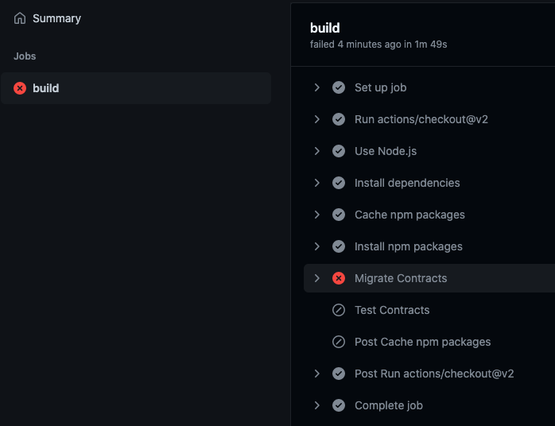

# Quorum Blockchain and DevOps Practice.

<h2> Quorum blockchain</h2>

Soft fork of the ethreum base code .

<h2>Primary Features</h2>

* Privacy - Transcation and smart contract on the blockchain can be private
* Voting based consesum mechanism - Raft based and istanbul byzantine fault tolerence (IBFT) consensus mechanism
* Peer/node permissioning using smart contracts - ensures that only known parties can join network
* Increased scalibility and network performance

<h2>Basic Architecture</h2>  


* Quorum-node- Soft-fork of geth
* Tessera(Privacy Manager) - Implemets privacy features of Quorum

The quorum node has the following feature

* PoW consensus has been replaced with other consesus protocol like IBFT,raft or QBFT. (_In the GoQuorum PoA consensus protocols, a group of nodes in the network act as validators (IBFT and QBFT), verifiers (Raft) or signers (Clique). Existing validators, verifiers, or signers vote to add or remove network nodes._)
* The P2P layer allows only permissioned nodes. 
* Gas pricing is removed. But the concept of gas still remains.
* The state patricia trie is split into 2 . the public and the private trie

<h2>Demo</h2>

The various components of the blockchain :-
```
*************************************
Quorum Dev Quickstart
*************************************
----------------------------------
List endpoints and services
----------------------------------
JSON-RPC HTTP service endpoint                 : http://localhost:8545
JSON-RPC WebSocket service endpoint            : ws://localhost:8546
Web block explorer address                     : http://localhost:25000/
Prometheus address                             : http://localhost:9090/graph
Cakeshop toolkit address                       : http://localhost:8999
Grafana address                                : http://localhost:3000/d/a1lVy7ycin9Yv/goquorum-overview?orgId=1&refresh=10s&from=now-30m&to=now&var-system=All

For more information on the endpoints and services, refer to README.md in the installation directory.
****************************************************************
```
* Validator - The miner , which is the block producer
* Nodes- These are the p2p nodes which actually form the network and more nodes can be added to the this network
* Tessera - This is the privacy manager , which has few functions like creation/manging of private keys , hashing transactions cryptograhically etc.
* rpc node - Can accept http/ws connection over the network for dapps or smart contracts.
* ethstats(block explorer) - provides various information about transactions based trasaction hash, block number etc.
* Monitoring and Logging - The standard stack for metrics is prometheus and grafana , along with ELK or splunk for monitoring

<h2> Sending requests to rpc node</h2>

```
curl -X POST --data '{"jsonrpc":"2.0","method":"web3_clientVersion","params":[],"id":1}' -H 'Content-Type: application/json' http://localhost:8545
```

<h4>Count the peers</h4>

```
curl -X POST --data '{"jsonrpc":"2.0","method":"net_peerCount","params":[],"id":1}' -H 'Content-Type: application/json'  http://localhost:8545
```
<h4> Finding the block number</h4>

```
curl -X POST --data '{"jsonrpc":"2.0","method":"eth_blockNumber","params":[],"id":1}' -H 'Content-Type: application/json' http://localhost:8545
```
<h3>Private transactions</h3>

This deploys the contract and sends an arbitrary value (47) from Member1 to Member3.

Once done, it performs a read operation on the contract using the get function and the contract’s ABI, at the address specified.

It then performs a write operation using the set function and the contract’s ABI, at the address and sets the value to 123.

Lastly, it performs a read operation on all three members to verify that this is private between Member1 and Member3 only, and you should see that only Member1 and Member3 return the result of 123, and Member2 has an undefined value.

After identifying the contract address, run the following command in each terminal:


<h4>Read contract with get()</h4>

Using eth.getTransactionReceipt(txHash), where txHash is the hash printed to the terminal after sending the transaction. The contract address is found in the result parameter contractAddress. It is also printed in the terminal when the private transaction is processed.

```
var address = "// replace with your contract address"; 
```
```
var abi = [{"constant":true,"inputs":[],"name":"storedData","outputs":[{"name":"","type":"uint256"}],"payable":false,"type":"function"},{"constant":false,"inputs":[{"name":"x","type":"uint256"}],"name":"set","outputs":[],"payable":false,"type":"function"},{"constant":true,"inputs":[],"name":"get","outputs":[{"name":"retVal","type":"uint256"}],"payable":false,"type":"function"},{"inputs":[{"name":"initVal","type":"uint256"}],"type":"constructor"}];
var private = eth.contract(abi).at(address)
```


<h4>Write to the contract with set()</h4>
Have Member1 set the state to the value 200 and confirm that only Member1 and Member3 can view the new state.

In terminal window 1 (Member1):


send to Member3

```
private.set(200,{from:eth.accounts[0],privateFor:["1iTZde/ndBHvzhcl7V68x44Vx7pl8nwx9LqnM/AfJUg="]});
"0xacf293b491cccd1b99d0cfb08464a68791cc7b5bc14a9b6e4ff44b46889a8f70"
```

You can check the log files in data/logs/ to see each node validating the block with this new private transaction. Once the block containing the transaction is validated, you can check the state from each of the members.

In terminal window 1 (Member1):


private.get()
200
In terminal window 2 (Member2):


private.get()
undefined
In terminal window 3 (Member3):


private.get()
200
Member2 can’t read the state.

All nodes are validating the same blockchain of transactions, with the private transactions containing only a 512-bit hash in place of the transaction data, and only the parties to the private transactions can view and update the state of the private contracts.

<h2> Basic CI/CD Demo</h2>

The CI/CD shows how you can leverage github actions deploy a smart contract .



<h2> Security on AWS</h2>

Ground Rules 
Below are ground rules to enforce - 
* Minimize your exposure - DO NOT expose unnecessary networking or instances on the public internet. 
* Implement the zero-trust with MFA enablement on all tools and production systems including AWS account, DevOps Tools (Jenkins), Bastion Servers and etc. 
* Secure your credentials with KMS backed automated solutions - database username, password, sensitive API keys and wallet key pairs are suggested to store on Key Management Service (KMS) backed solutions. Applications need to integrate the SDK to automate this process. 
* Grant least privilege to your users - never grant unnecessary permissions to your users or applications. 
* Manage your Infrastructure as Code -  Manage the infrastructure, configuration as code to automate and make implementations consistent with designs. 

DevOps Guidelines and Best Practices
Below are guidelines you need to follow based on the current system design and security rules. 
<h4>Network Design:</h4>

* IP CIDR Plan - Pick a vpc cidr that is not overlapped with existing network.
* Cross-AZ High Availability - The basic subnet design should have three types subnet across all availability zones. Most aws regions have at least three availability zones.
* Three public subnet which has default route point to igw
* Three nat subnet which has default route point to natgw. You need to put one natgw in each of availability zone
* Three private subnet which has no default route
* You can add more subnets just for management purposes when necessary, but the type will always be three. For example, you can create different subnets for internal alb, redis, rds, but they should bind to the same route table which has no default route which you can create different subnets for ec2 and ecs, but they should bind to the same nat route table.
* Routing Table Design - No matter what kind of vpc you are using, 5 route table is enough and has best practice for 3 availability zone region
* One public route table which has a default route to igw. It can be bound to the public ec2 subnet, external ALB subnet, etc.
* One private route table which has no default route. It can be bound to redis subnet, rds subnet, etc.
* One nat route table which is the default route to natgw for each availability zone. It can be bound to nat ec2 subnet, nat ecs subnet, etc.
* Minimize exposure with public subnet design - Although you can have public subnet point to igw, usually you will only put external alb in this subnet. Use the following ways if you want to put ec2 in a public subnet.
* For ssh access: using aws session manager instead.
* Open service for public access: using external alb and put ec2 behind it
* EIP will only need to be bind to natgw, ec2 and rds usually doesn’t need to bind public ip
* Security Group - Create a different security group for each of aws services such as ec2/alb/ecs/rds/redis etc even some of the resources may have the same security group rule. And just open specific and source with least privilege
* Use terraform to design and manage your networking.
* Networking Topology - For external system, you should use cloudfront->external alb->services arch, enable aws shield and waf on cloudfront and alb
* S3 Bucket Access - For S3 bucket, never set s3 bucket as public access. Always put cloudfront in front of s3 for public access content such as static js file.

<h4>AWS Account and IAM Management:</h4>

* Root account management - Enable 2fa/yubikey for root account. The root account should be locked down and never use it in daily operation. Please transfer the ownership of the root account for centralized management. 
* Terraform IAM Module
* Never create Access & Secret Key pairs on production systems - Never create access key/secret access key, use the following ways instead.
* For ec2/ecs/lambda etc to access aws services, always use role
* For local development, use saml2aws to get temp ak/sk

<h4>DevOps Tool Security</h4>

* Zero-Trust Security on daily DevOps - For internal systems that need web access such as jenkins,grafana,kibana,aws,archery, etc, you need to integrate with okta. Whitelist vpn ip in security group and build private connection between vpc.
* Bastion Server v.s. AWS Session Manager - AWS Session Manager usually provides better security over open source or commercial bastion servers. If you need to have a dedicated bastion server solution, please reach DevSecOps team for discussions.

<h4>Sensitive credential management and integrations</h4>

* Credentials such as database access credentials, wallet key, api key should be kept in AWS secrets manager (KMS backed), where applications need to integrate AWS SDK for access.  Note that we usually need to separate the access credentials for applications from manual operations - like database management.
